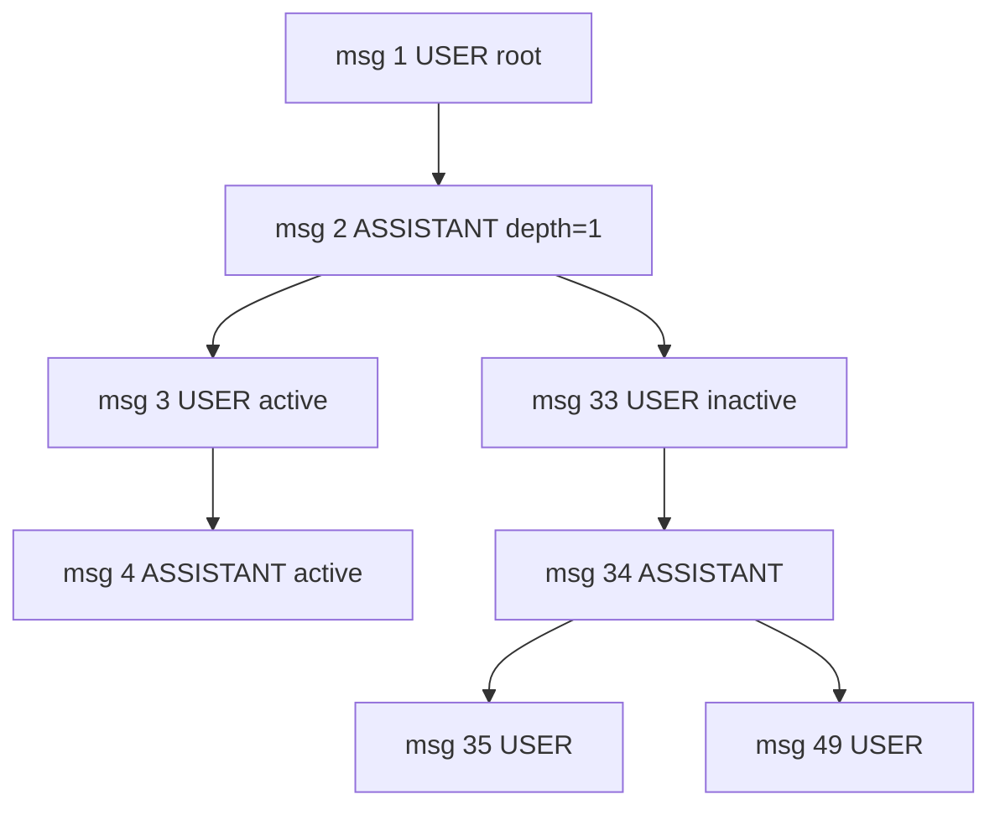

# SessionTree 数据结构（schema 冻结）

> 日期：2026-05-07
> 状态：Frozen for v0.4.0 implementation
> 关联：[adr-001-branch-tree-route.md](./adr-001-branch-tree-route.md) / [tools-tree-draft.md](./tools-tree-draft.md)

本文档冻结二期实施所依赖的对外数据结构。bridge 内部辅助字段不在此处约束。

---

## 顶层：`SessionTree`

```ts
interface SessionTree {
  // 会话元数据（与 get_session 的 session 字段一致 + 全树版）
  session: ChatSessionMeta;

  // 树形索引
  rootMessageIds: number[];      // 通常长度 1；理论支持多 root
  currentMessageId: number | null; // 服务端 active leaf；可能为 null（异常）
  activePathIds: number[];       // root → current 的有序数组；可能为空（current 不在树中）
  branchPointIds: number[];      // children >= 2 的节点 id 列表，按 messageId 升序

  // 节点 map（外接 O(1) 查询；序列化为对象，不是 ES6 Map）
  nodes: { [messageId: string]: MessageNode };

  // 统计信息
  stats: {
    totalMessages: number;       // = Object.keys(nodes).length
    branchPointCount: number;    // = branchPointIds.length
    leafCount: number;           // childrenIds.length === 0 的节点数
    maxDepth: number;            // 任意 leaf 的最大 depth + 1
    activePathLength: number;    // = activePathIds.length
    inactiveMessageCount: number;// = totalMessages - activePathLength
    orphanIds: number[];         // parent_id 不在 nodes 里的节点（异常）
    warnings: string[];          // diagnostics（如 "current_message_not_in_tree"）
  };

  // 来源
  sourceUrl: string;
  timestamp: string;             // ISO
  contentMaxLen: number;
  truncatedToLimit?: boolean;    // 若调用方传了 limit
}
```

`ChatSessionMeta` 完全复用 `bridges/common.js::normalizeChatSessionItem` 的输出，不变。

## 节点：`MessageNode`

```ts
interface MessageNode {
  // 服务端字段（与 normalizeChatMessage 完全一致）
  messageId: number;
  parentId: number | null;
  role: 'USER' | 'ASSISTANT' | 'SYSTEM' | string;
  status: string;                // FINISHED / STREAMING / INTERRUPTED / CONTENT_FILTER / ...
  model: string;
  thinkingEnabled: boolean;
  searchEnabled: boolean;
  banEdit: boolean;
  banRegenerate: boolean;
  accumulatedTokenUsage: number | null;
  files: number;
  feedback: boolean | null;
  insertedAt: string | null;     // ISO
  contentLength: number;
  contentTruncated: boolean;
  thinkingContentLength: number;
  thinkingContentTruncated: boolean;
  thinkingElapsedSecs: number | null;
  searchStatus: string | null;
  searchResultsCount: number;

  // 树重建新增字段（service 端无）
  childrenIds: number[];         // 反向索引；按 insertedAt 升序
  depth: number;                 // root = 0
  siblingIndex: number;          // 在父的 childrenIds 中的下标；root 取 0
  siblingCount: number;          // 父的 childrenIds 长度；root 取 1
  isOnActivePath: boolean;       // 是否在 activePathIds 中
  isBranchPoint: boolean;        // childrenIds.length >= 2
  isLeaf: boolean;               // childrenIds.length === 0

  // 正文（按 redact 策略）
  content: string | null;        // redact='off' 时为 null；'trunc' 截断；'full' 完整
  contentHash: string;           // sha256，永远输出
  contentRedactedMode: 'off' | 'trunc' | 'full';
  contentRedactedTruncated: boolean;
  thinkingContent: string | null;
  thinkingContentHash: string;
  thinkingContentRedactedMode: 'off' | 'trunc' | 'full';
  thinkingContentRedactedTruncated: boolean;
}
```

## 索引语义保证

二期实现必须满足下列不变量（单元测试覆盖）：

1. `rootMessageIds.every(id => nodes[id].parentId === null)`
2. `branchPointIds.every(id => nodes[id].childrenIds.length >= 2)`
3. 对每个 node：`nodes[parentId].childrenIds` 包含自己（反向一致性）
4. 对每个 node：`childrenIds.every(c => nodes[c].parentId === messageId)`
5. `activePathIds[0] === root`，`activePathIds[last] === currentMessageId`（若 currentMessageId 在树中）
6. `stats.totalMessages === Object.keys(nodes).length`
7. `stats.leafCount + branchPointCount + (单 child 内部节点数) === totalMessages`（恒等式 sanity）
8. `siblingIndex < siblingCount`，且对同 parent 的 children：`siblingIndex` 互不相同、覆盖 [0, siblingCount-1]
9. 节点的 `isLeaf` 与 `childrenIds.length === 0` 永远一致；`isBranchPoint` 与 `childrenIds.length >= 2` 一致

## 大小估算

实测 session：292 节点。每节点元数据（无正文）≈ 400 字节，全树元数据 ≈ 120KB；含正文（redact='full' 60KB cap）最坏 ≈ 17MB。

→ **`get_session_tree` 默认 redact='off'，仅元数据 + sha256 + length**；含正文必须显式 `--include-content` 且建议带 `--content-max-len 1000` 之类的下调。

## 示例（mermaid 树形）

测试 session 中 messageId=2 处的局部分支（已脱敏）：



> 实际响应里 messageId=2 的 children 是 `[3, 33]`；msg 33/34/49 等都不在 active path 上。

## 示例（JSON 片段）

```json
{
  "session": {
    "id": "d54aadf1-9f49-4f16-a8ee-a6aae6843f3a",
    "version": 292,
    "currentMessageId": 292,
    "title": "<redacted>"
  },
  "rootMessageIds": [1],
  "currentMessageId": 292,
  "activePathIds": [1, 2, 3, 4, 5, "...126 ids..."],
  "branchPointIds": [2, 18, 28, 34, 66, 72, 80, 84, 118, 166, 194, 198, 206, 226, 244, 256, 276],
  "nodes": {
    "2": {
      "messageId": 2,
      "parentId": 1,
      "role": "ASSISTANT",
      "status": "FINISHED",
      "childrenIds": [3, 33],
      "depth": 1,
      "siblingIndex": 0,
      "siblingCount": 1,
      "isOnActivePath": true,
      "isBranchPoint": true,
      "isLeaf": false,
      "contentLength": 1652,
      "contentHash": "sha256-...",
      "content": null,
      "contentRedactedMode": "off"
    },
    "33": {
      "messageId": 33,
      "parentId": 2,
      "role": "USER",
      "childrenIds": [34],
      "depth": 2,
      "siblingIndex": 1,
      "siblingCount": 2,
      "isOnActivePath": false,
      "isBranchPoint": false,
      "isLeaf": false
    }
  },
  "stats": {
    "totalMessages": 292,
    "branchPointCount": 17,
    "leafCount": 18,
    "maxDepth": 67,
    "activePathLength": 126,
    "inactiveMessageCount": 166,
    "orphanIds": [],
    "warnings": []
  }
}
```

## 兼容策略

- 现有 `deepseek_get_session.messages[]` 字段与 `MessageNode` 的"服务端字段"区段保持完全一致 —— 二期 `get_branch_path` 工具直接复用 `messages[]` schema，不引入新形态
- `MessageNode` 在 `messages[]` 字段基础上 additive 加了树重建字段；上层不消费这些字段时与旧 messages[] 兼容（superset）
